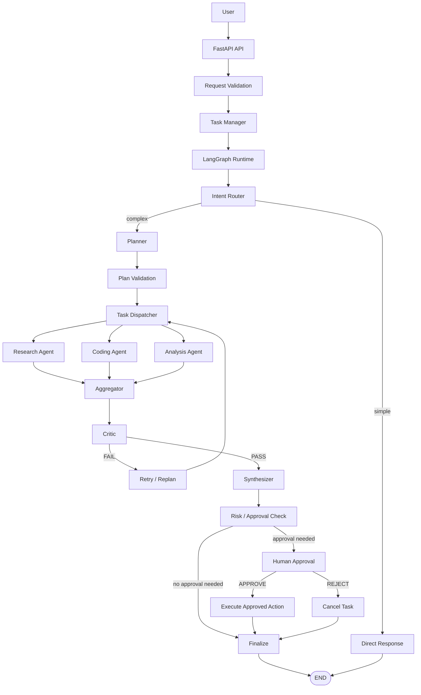
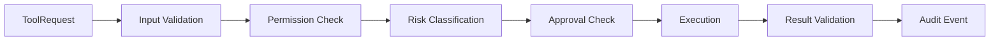

# Architecture

> **Status: target design.** Only the entry point and liveness endpoint are
> implemented (Phase 1). Everything else in this document describes the intended
> design and is annotated with the phase that delivers it.

## Design goals

The system must be modular, typed, testable, fault tolerant, observable, secure,
stateful, resumable, provider-independent, and Docker-ready. Where these goals
conflict, correctness and reliability win over sophistication: a simpler design
that actually works beats a more clever one that does not.

## Request flow

## Layer responsibilities

| Layer | Responsibility | Phase |
| --- | --- | --- |
| `app/api` | HTTP surface, validation, authentication hooks, rate limiting, error mapping. Contains no business logic. | 23, 25, 26 |
| `app/core` | Configuration, structured logging, exception hierarchy, security primitives, constants. | 2, 27 |
| `app/graph` | LangGraph state definition, node implementations, conditional edges, routing, checkpoint persistence. | 7, 16, 21 |
| `app/agents` | Agent implementations. Each declares its own allowed tools and never touches the database or graph internals directly. | 12-15, 19 |
| `app/tools` | Tool implementations plus the least-privilege registry. Every call flows through validation, permission, risk, approval, and audit stages. | 9-11 |
| `app/memory` | Short-term, working, long-term semantic, and execution memory behind a single manager interface. | 20 |
| `app/models` | Domain models. | 3 |
| `app/schemas` | Pydantic boundary contracts: requests, responses, plans, events. | 8, 13, 23 |
| `app/services` | LLM, embedding, execution, memory, and evaluation services — the provider abstractions live here. | 4-6, 36 |
| `app/database` | Engine and session management, ORM models, repositories. | 3 |
| `app/observability` | Structured logging, tracing, metrics, execution events. | 27 |

## Key architectural decisions

**The graph and agents depend on abstractions, not vendors.** The LLM and
embedding providers sit behind interfaces (`app/services/llm.py`,
`app/services/embeddings.py`), so agents never import a vendor SDK and the graph
is testable against a deterministic fake provider with no network access.

**State is typed and serializable.** The graph state is a typed structure rather
than a loose `dict[str, Any]`, because it must survive checkpointing and
round-trip through serialization. Anything not serializable cannot be
checkpointed.

**Every loop is bounded.** Iteration counts, tool-call counts, wall-clock time,
and retries all have configured maxima. Unbounded agent loops are prohibited by
design, not merely discouraged.

**Tools are least-privilege.** An agent receives only the tools it is explicitly
authorized to use. Every tool call passes a fixed pipeline:

Risk levels are `LOW`, `MEDIUM`, `HIGH`, and `CRITICAL`. Destructive `HIGH` and
`CRITICAL` operations never execute automatically.

**External content is untrusted.** Web pages, retrieved documents, repository
files, and database rows are data, never instructions. They cannot override
system policy, and tools never act on instructions embedded in retrieved
content.

**Checkpointing is durable.** Execution state is persisted so a run can be
interrupted, inspected, resumed, and recovered after a crash. Human approval
uses the same mechanism: the graph interrupts, an approval record is persisted,
and the graph resumes with the decision.

**Nothing exposes hidden reasoning.** Clients receive concise status, tool
activity, safe summaries, and final output. Internal chain-of-thought, raw
prompts, credentials, and secrets are never surfaced through the API or logs.

## Configuration and secrets

All configuration is loaded once through a typed settings layer
(`app/core/config.py`, Phase 2). Application code never reads environment
variables or secrets directly. Secrets come from the environment or a secret
store and are `.gitignore`d; `.env.example` documents the variable names and
placeholder values only.

## Test strategy

| Layer | Approach |
| --- | --- |
| Unit | Configuration, state, schemas, router, planner, agents, registry, risk classifier, memory manager — all without network access. |
| Integration | Database, Redis, checkpointing, graph execution, tool execution — against real services where available. |
| Graph | Simple, complex, parallel, critic pass/fail, retry, replan, approval, rejection, resume, and failure recovery paths. |
| API | Route behaviour: chat, task creation, status, approval, rejection, cancel, health. |
| Security | Path traversal, prompt injection, unauthorized tools, cross-user access, SSRF, unsafe SQL, secret leakage. |
| Evaluation | Deterministic benchmark cases with rule-based scoring, not an LLM judge alone. |

LLM calls are replaced with deterministic fakes in unit and graph tests so the
suite runs offline and produces stable results.
